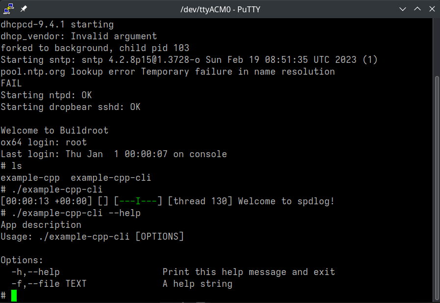

# Buildroot Bouffalo CMake example

This is an example project that uses CMake and [Vcpkg package manager](https://github.com/microsoft/vcpkg)
to compile a simple example C++ project, as an example for the 
[Ox64 RISC-V single board computer](https://wiki.pine64.org/wiki/Ox64).
This uses the [Buildroot Bouffalo Linux](https://github.com/openbouffalo/buildroot_bouffalo)
for the BL808 CPU that is used in the Ox64 board.

This example project can be built on any Debian or Arch system.
The project will be cross compiled and can be run on the 
[Ox64 board](https://wiki.pine64.org/wiki/Ox64).

## Why?

The purpose is to demonstrate how can Vcpkg be used with the Buildroot Bouffalo SDK
to create an application. With Vcpkg we have access to potential +2000 C & C++ libraries.

## How?

The Vcpkg uses triplets to define target system and can be used for cross compilation.
We have to provide `CMAKE_TOOLCHAIN_FILE` CMake variable during configuration with
`VCPKG_CHAINLOAD_TOOLCHAIN_FILE` at the same time. The same `VCPKG_CHAINLOAD_TOOLCHAIN_FILE`
must be set from the custom triplet `cmake/triplets/x64-linux-boufallo.cmake` located
in this project.

With this, we can include almost any Vcpkg library and compile it for the Buildroot Bouffalo Linux.
All of the hard work is done by the Vcpkg.

## Tutorial


### 0. System dependencies

```bash
sudo apt-get install -y build-essential tar curl zip unzip cmake git wget
```

### 1. Prepare Ox64

Follow the flashing instructions to prepare the Ox64 board:
<https://github.com/openbouffalo/buildroot_bouffalo#flashing-instructions>

### 2. Clone Vcpkg into the system

The vcpkg must be present in your host system. Follow the install instructions from:
<https://github.com/microsoft/vcpkg>

For example, cloning it into the `/opt` directory.

```bash
cd ~
git clone https://github.com/microsoft/vcpkg
sudo mv ./vcpkg /opt/vcpkg

/opt/vcpkg/bootstrap-vcpkg.sh

sudo ln -s /opt/vcpkg/vcpkg /usr/local/bin/vcpkg
```

### 3. Get the Buildroot Bouffalo Linux SDK

Go to: <https://github.com/openbouffalo/buildroot_bouffalo/releases> and download
the `riscv64-buildroot-linux-gnu_sdk-buildroot.tar.gz`. Extract it in the `/opt` directory.

Unfortunatelly, due to how triplets work, the SDK folder must be exactly `/opt/riscv64-buildroot-linux-gnu_sdk-buildroot`. (*I am working on finding a way
to pass forward some custom CMake variable that can be picked up by the
triplet file for the SDK location.*)


```bash
wget https://github.com/openbouffalo/buildroot_bouffalo/releases/download/v0.0.5/riscv64-buildroot-linux-gnu_sdk-buildroot.tar.gz
tar -xvzf riscv64-buildroot-linux-gnu_sdk-buildroot.tar.gz
sudo mv ./riscv64-buildroot-linux-gnu_sdk-buildroot /opt/
```

No need to call `environment-setup` or `relocate-sdk.sh`. It is not necessary for this project.

### 4. Configure the project

Clone this project first.

```bash
git clone https://github.com/matusnovak/buildroot-bouffalo-cmake-example.git
cd buildroot-bouffalo-cmake-example
```

Create a CMake build directory.

```bash
mkdir build
```

Configure the project. You must set `CMAKE_TOOLCHAIN_FILE` to the correct Vcpkg toolchain, as per Vcpkg documentation.
You must also set `VCPKG_CHAINLOAD_TOOLCHAIN_FILE`, which must match `cmake/triplets/x64-linux-boufallo.cmake`.

```bash
cmake -B ./build \
    -DCMAKE_TOOLCHAIN_FILE=/opt/vcpkg/scripts/buildsystems/vcpkg.cmake \
    -DVCPKG_CHAINLOAD_TOOLCHAIN_FILE=/opt/riscv64-buildroot-linux-gnu_sdk-buildroot/share/buildroot/toolchainfile.cmake
```

**Note:** This will start downloading CLI11 and spdlog C++ dependencies. They are used only for demonstration purposes.
Depending on your hardware and internet speed this may take a minute or two.

Once configured you should see something like this:

```txt
-- Running vcpkg install - done
-- The C compiler identification is GNU 10.2.0
-- The CXX compiler identification is GNU 10.2.0
-- Detecting C compiler ABI info
-- Detecting C compiler ABI info - done
-- Check for working C compiler: /opt/riscv64-buildroot-linux-gnu_sdk-buildroot/bin/riscv64-unknown-linux-gnu-gcc - skipped
```

Make sure the compiler is correct. Don't worry it has been skipped!

### 5. Compile

```bash
cd buildroot-bouffalo-cmake-example
cmake --build ./build --target all
```

### 6. Move it to the Ox64 board

Grab the SD card (make sure that the SD card was booted from at least once) and mount it into your system.

Now move the `example` binary from the `build` folder into the SD card folder, for example into the `/root`
folder (a home directory for your root user).

### 7. Start the Ox64 board and run the program

Running the program is easy, just execute the binary, example below.

**Note:** I have renamed the binary in my screenshot.



## FAQ

### Can I run the executable on my host system?

No, but you can set `VCPKG_TARGET_TRIPLET=x64-linux` and remove `VCPKG_CHAINLOAD_TOOLCHAIN_FILE` 
and then you can re-configure and re-build the project to be run on your host Linux.
In short, you will replace the RISC-V compiler with your host one. Vcpkg will work the same way.

### Can I use shared libraries?

No, you are limited to static libraries. Good news is that all Vcpkg libraries are meant
to be compiled statically so almost everything should work out of the box.

### Can I use C++17?

So far it looks like yes. There might be some features disabled, so far I haven't found an issue.

### Error Relocations in generic ELF (EM: 243)

Make sure you have set `-DVCPKG_CHAINLOAD_TOOLCHAIN_FILE=/opt/riscv64-buildroot-linux-gnu_sdk-buildroot/share/buildroot/toolchainfile.cmake` when you are configuring the project with CMake.
This toolchain file must also match the one in the `cmake/triplets/x64-linux-boufallo.cmake` file.

If it still does not work, remove the `build` folder and try again. Sometimes the CMake variables
can be cached.

